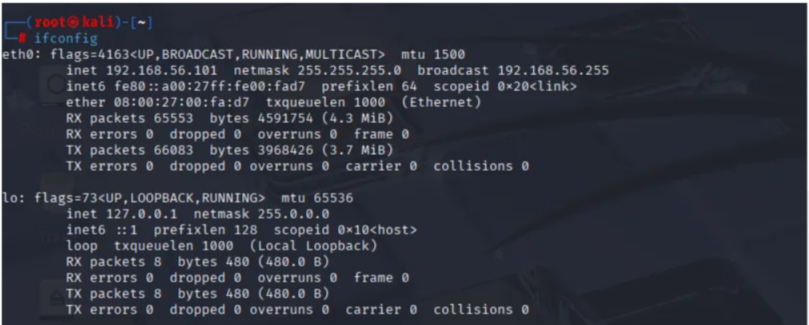
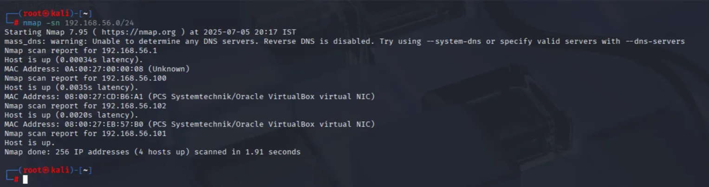
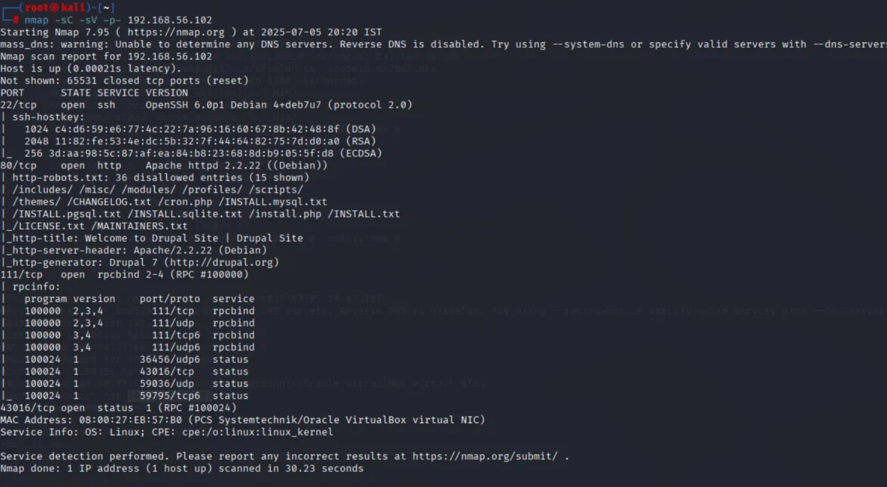
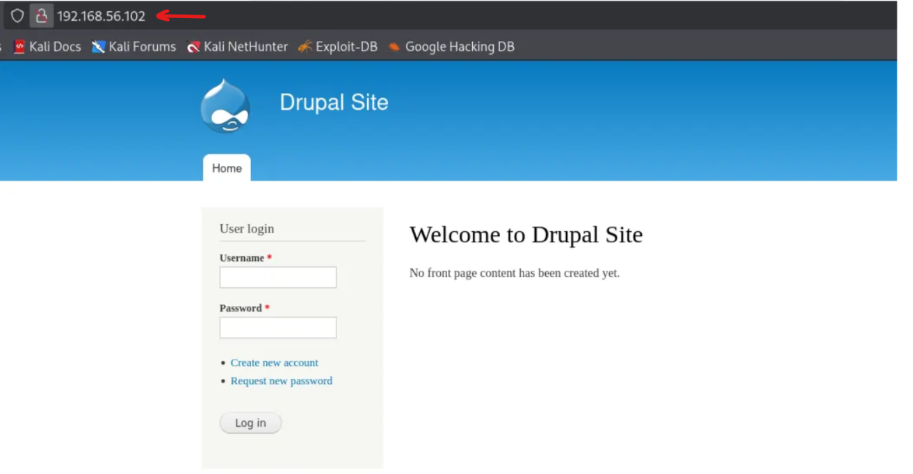
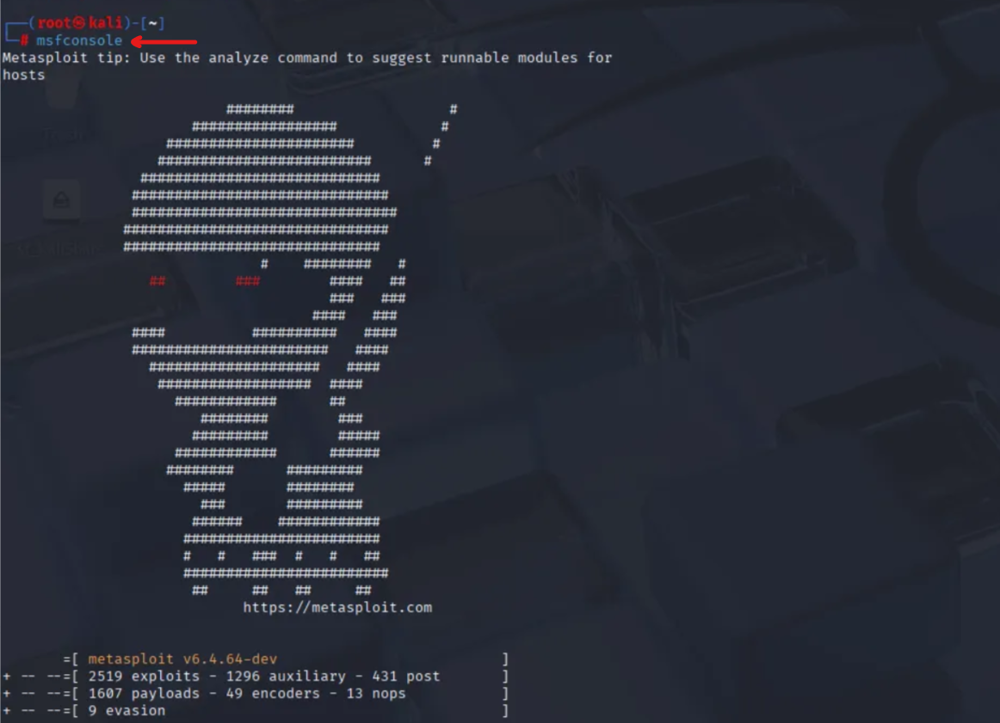
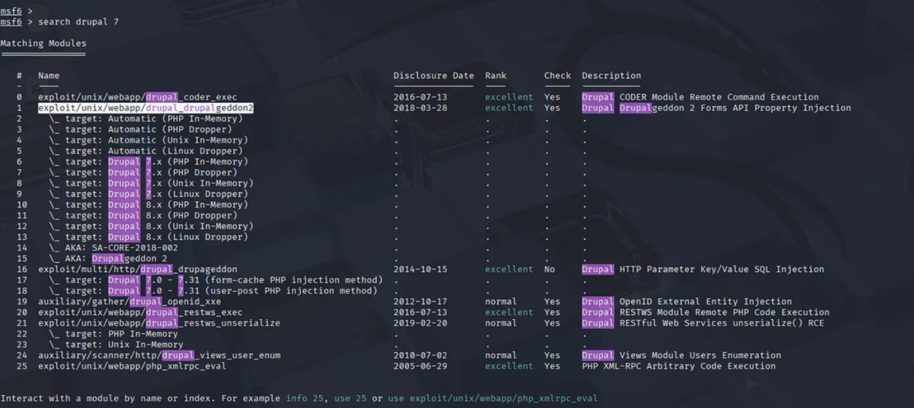
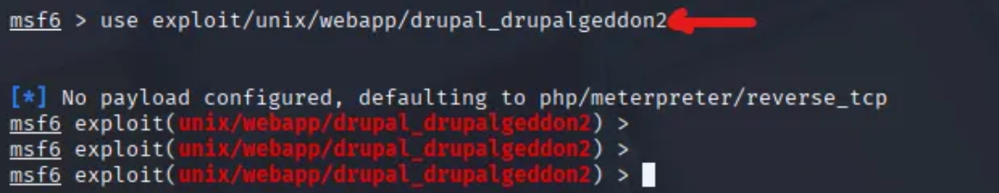

DC-1 Walkthrough

Lets check whats our IP address is

ifconfig 

So our IP address is : 192.168.56.101

Lets find the IP address of target machine

nmap -sn 192.168.56.0/24 

-sn → Ping scan (no port scan)

Target IP address is 192.168.56.102

Now lets perform port scanning using nmap 

nmap -sC -sV -p- 192.168.56.102

-sC will run default NSE scripts

-sV will Detects service versions

-p- will scans all 65535 ports

On port 80, http is running. NMAP also enumerated that Drupal 7 is running. Drupal is a CMS (Content Management System)

A CMS is software that lets people create, manage, and modify a website without coding.

Lets open port 80

Lets search if there are any exploits available for Drupal in Metasploit

msfconsole 

search drupal 7

Lets use 1st module

